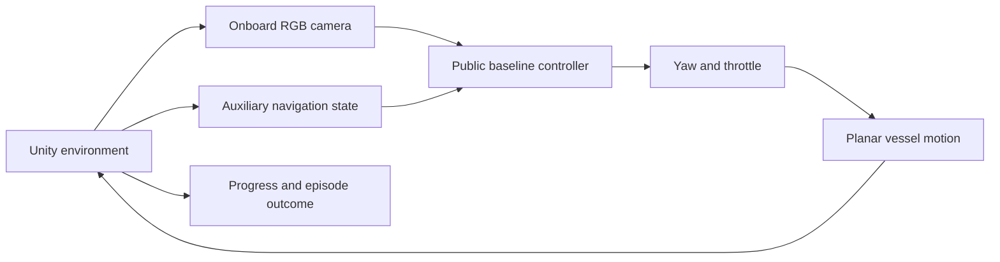

# Vision-Based USV Navigation — Minimal Demo

A small Unity demonstration of the **camera observation → navigation decision → vessel motion → feedback** loop for an unmanned surface vessel (USV).

**Pre-publication release:** this repository reproduces a simplified navigation loop. It does not reproduce the paper's training procedure, learned behavior, or quantitative results. The included controller is a hand-written baseline that uses RGB pixels and auxiliary navigation state.

## Research overview

The full research project explores vision-assisted multi-USV navigation in simulated maritime environments. It combines onboard camera observations with auxiliary navigation/environment state, uses continuous control through Unity ML-Agents, and includes reward terms for goal progress, buoy-side navigation and vessel encounters. The inspected complex-scene configuration uses PPO and a visual encoder. Rule-inspired rewards alone do not establish navigation-rule compliance.

This public subset demonstrates the interface and basic environment loop; it contains newly written demonstration code and procedural geometry.

## Run

1. Add this directory as a project in Unity Hub and open it with **Unity 2022.3.62f1**. This is a Built-in Render Pipeline demo.
2. Select **USV Mini → Create demo scene** in the editor menu.
3. Press **Play**. The scene is generated from primitives; no imported models are needed.
4. Watch the overhead view and the onboard RGB image in the upper left. Use **Restart episode** to repeat the fixed initial condition.

No Python environment, ML-Agents installation or model weights are required. A normal graphics-capable Unity session is needed for image rendering.

## Validation

Checked with Unity 2022.3.62f1 on Linux: script compilation and scene creation passed. A graphics-enabled Play Mode smoke run captured the onboard RGB image and reached the goal in **152 decisions** from the fixed starting condition. This checks the demo's basic operation, not research performance or robustness across scenarios.

## What is reproduced?

| Component | Public demo |
| --- | --- |
| Environment | One vessel, three red/green buoy pairs and a goal |
| Visual observation | Actual Unity camera image, 84 × 84 RGB |
| Auxiliary observation | Goal in the vessel frame, goal distance and forward speed |
| Decision | Pixel color centroids combined with goal heading |
| Action | Continuous yaw and throttle, each in `[-1, 1]` |
| Motion | Simple planar kinematics at a 0.1-second decision interval |
| Feedback | Distance progress, step cost and terminal outcome |
| Termination | Goal, buoy proximity, boundary exit or 600-step timeout |

The baseline extracts red/green pixel centroids and steers toward their image midpoint while tracking the goal. It falls back to goal heading when both colors are not visible. It receives no buoy world coordinates. The environment uses those coordinates for the simplified collision check. Goal information is supplied directly as auxiliary state; this is not camera-only navigation or a learned perception system.

Yaw is mapped to ±45 degrees/second. Throttle is mapped to 0–3 metres/second. These are illustrative demo parameters. Vessel shape, dynamics, collision radius, reward and layout are simplified and are not research settings.

## Code

- [`MinimalUSVDemo.cs`](Assets/Scripts/MinimalUSVDemo.cs): procedural environment, camera capture, `Observe()`, baseline, `Step(action)` and episode feedback.
- [`CreateMinimalScene.cs`](Assets/Editor/CreateMinimalScene.cs): editor command to generate the scene.

`Observe()` returns four auxiliary values and refreshes the RGB texture. `Baseline()` demonstrates how those observations can produce an action. `Step()` advances the environment and records feedback. These methods illustrate the boundary where a learned policy could be connected; this release does not provide a training adapter.

## Scope of this release

The public subset excludes full reward formulas and tuned training configurations, multi-vessel coordination/reset logic, research harbor scenes, ocean/boat asset packages, trained checkpoints, experiment logs and evaluation results. It also excludes the original repository history.

The demonstration score is only feedback for this toy environment. It is not a reported paper metric. Successful navigation in this fixed buoy corridor is not evidence of general obstacle avoidance, multi-vessel capability or maritime-rule compliance.
